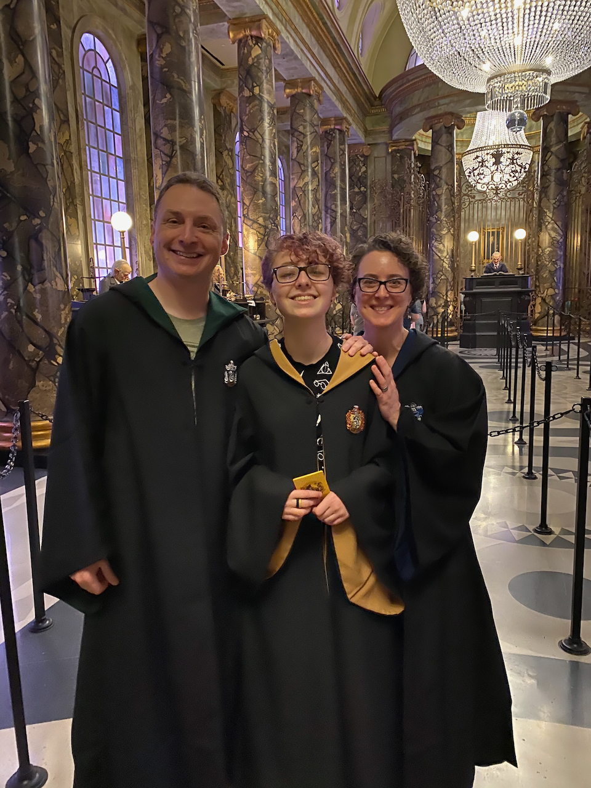

# Doug Gaff Manager Readme

Based on Matt Newkirk's [Manager Readme](https://mattnewkirk.com/2019/01/02/avoiding-mistakes-with-your-manager-readme/) this document is to help you get to know me as a manager. Matt says that manager readmes should 1) Share expectations to reduce a person's anxiety working with you and 2) Build trust as they get to know you. I would add that **I want you to know me as a person first, leader second**, and this document attempts to accomplish that.

## Basic Statistics

**Age:** 49 
**Family**: Brenda, Delia, and Ginger the cat 
**States lived in**: IL, OH, NY, VA, MA, NH 
**Countries visited**: 16 
**Education**: BS and MS Electrical Engineering from Virginia Tech 
**Hobbies**: Snow skiing, mountain biking, hiking, fishing, golf, ice hockey, handyman, ham radio, drones, electronics, model trains, audio engineering, all things music, archery and target shooting, and some rock climbing. 
**Personality**: If you find this helpful, here are some results.

* [ENTJ](https://www.16personalities.com/entj-personality).
* [Enneagram 3](https://www.enneagraminstitute.com/type-3).
* [Clifton Strengths: Strategic, Futuristic, Learner, Communication, Input](https://www.gallup.com/cliftonstrengths/en/253715/34-cliftonstrengths-themes.aspx). 
* House of Slytherin. (I was bummed about this and took the test twice, but there you go.)
* [Love language: Words of Affirmation](https://www.5lovelanguages.com/). 
* Birkman: too complicated of a system to list here. I can share it with you.

## Who cares about stats, who are you really?

I was born outside of Chicago to parents from Indiana. My parents were 18 and 23 when I was born! I moved around a lot as a kid because of my Dad's career as an architect. We eventually ended up in Roanoke, Virginia when I was a pre-teen, which is how I landed at Virginia Tech. My parents divorced when I was 10, and they're both remarried. While our ancestry is all from Indiana, my immediate and extended family now live all over the US. So, there is no longer one place any of us calls home anymore. I tell this story because living in several places and moving around a lot has deeply shaped who I am as a person. 

I’ve been tinkering with electronics and computers since I was very young. My late grandfather was an electrician at GE, and he taught me to solder when I was around 10 years old. I wasn’t very good at it at first and used to burn myself regularly. He also regularly gave me stuff that GE was throwing away for me to take apart. My parents supported this electronics habit, too, by buying electronics kits for me (remember Radio Shack and Heathkit?), by ensuring I had an electronics workbench in the basement, and by getting me my first computer, a Commodore 64. I wanted to be a mad scientist inventor as a kid. I read books about Tesla and Edison and dreamed about building labs for inventing. I have an electronics workbench in my basement today. 

My personal value words are *Relationships, Humor, Adventure, Intellect, Achievement*. When I am able to keep these five things in balance, they help me show up as my best self. When these five things get out of balance, I am more stressed and don't show up as well to others. Here's more detail on these value words.

**Relationships:** One of my favorite thing in the world is to have deep, thoughtful, personal conversations with other people. I believe strong interpersonal relationships are the foundation for everything else. In the workplace, they are the foundation of trust. As such, I don't enjoy transactional relationships, either at work or in my personal life. This means I frequently struggle with people who are guarded and struggle to open up to others. I also find it more difficult to establish meaningful relationships over zoom or in remote work settings. I still build these relationships, but it takes me longer than it would in person. This is a challenge in my work environment and something I’m continuing to work on.

**Humor:** I have a good sense of humor and love to laugh and have fun. My sense of humor can be irreverent at times, but you have to get to know me more intimately to see the more irreverent side. As with relationships, my sense of humor translates much better in-person than in remote life. This probably has something to do with comedic timing and being able to read a room. 😄 So learning to infuse humor when we are all on zoom all the time is something I'm still working on and haven't figured out.

**Adventure:** Adventure is the rejuvenating force in my life. My flavor of adventure is exploring, being in nature, and being a speed junkie. Skiing and mountain biking feed the speed junkie in me. Hiking and other activities in nature recharge me. And I love exploring new places, even if it’s just a day trip somewhere new, ideally with our bikes on the back of my truck. I hope to fly a jet pack or a human-sized drone one day, and I need to do this before I get too old and people say, "Doug, do you really think that's a good idea?" 😄

**Intellect:** I'm a smart and cerebral guy. It's not just book smarts or cool technical things, though. I crave wisdom...not quite philosophy or religion, but more the study of humans and how we all interact, which is why I love people relationships so much. I believe this human curiosity is an important quality of a manager and leader.

**Achievement:** When it comes to achievement, I have a lot of drive, both professionally and personally. For better or worse, I guess you can put me in the stereotypical high achiever bucket. Why achievement is important to me is a conversation for us to have as we build a meaningful relationship with each other. See also in the stats above, House of Slytherin. 

Ok, one last thing. Ask me what I live for, and I'll tell you that I like to **build and belong**. Building means a lot of things. It means building all things maker-related and goes back to my childhood desire to be a mad scientist inventor. Building also means building my family, building relationships, building teams, building organizations, and building companies. I'm happier when I'm building. Belonging is about relationships: my family, my community, my friends, my extended tribe, and my company. 

## My flaws

So the last section is all 🌈 and 🦄. It's aspirational and my best self, and maybe you’re like, “Whatever, Doug.” But I'm a broken human like the rest of you, so I figure I should explain those parts of me, too.

My number one flaw is that *I am impatient and stubborn*. This one is harder to see unless you get close to me, but you can ask my wife about this if you want. 😁 At work, this translates to me sometimes being inflexible and sometimes being frustrated when things are taking too long or not coming to a clear conclusion.

My number two flaw is that *I have unrealistic expectations of myself and those around me*. Related to achievement above, I'm never fully satisfied with my own work, and I'm always judging the ways I wish I had done things better. While a certain amount of this is good because it helps me get better, it is frequently unhealthy. I've worked on it for years with coaches, but I'm still not where I need to be. 

The weird thing about how these unrealistic expectations surface when I lead is that I severely overcorrect in my interactions with others. This can mean that I struggle to push people, be decisive, and give balanced feedback because the narrative in my head sounds too much like being a jerk. Feedback is critical, though, and so I'm working hard to get better at dialing this to the right volume.

I have more flaws, but I think they are side effects of these two big ones. However, feel free to point them out. It’s the only way I’ll learn. 😜

## What to expect from me & what I need from you

This section is organized by my leadership principles. These principles describe how I will strive to work with you. I won't always get this right, of course, but if I'm doing a good job, this is what you can expect.

### Honesty & Transparency

Perhaps you can tell from this readme, but I'm a very transparent person. I will be transparent with you, sometimes to a fault. I will tell you what I'm thinking. I will tell you what I'm worried about. Barring any legal or regulatory issues, I will tell you what's going on at the company. 
  
* Talk to me about anything & everything.
* If you feel like you're failing, tell me. I might feel that way, too, but don't worry. I will work to support you to get you to a better spot.
* Fail as fast as you can, and then learn.
* Don't kiss my ass. I can see through it, and it will erode my trust in you.

If you don't hear from me, it's not because I've abandoned you, it's likely because I'm swamped. My communication gets really poor when I'm overloaded.

Finally, *I hate company politics, and I despise people who are in it for themselves.* I have a pretty good bullshit meter, so if you try it, I will very likely see through it. If you are repeatedly political, I will write you off. Seriously, politics are the opposite of my value of honesty.

### Empathy & Feedback

Hopefully at this point you can see how empathy plays a big part in how I lead. I will give you a lot of rope to learn and grow, likely more than other managers have given you and sometimes more than I should. This comes from my belief that everyone can grow and get better with the right feedback and growth mindset. So, if you're being transparent with me about what's working and not working for you, I will be more engaged in your success. This is a “trust first” model, not a “trust but verify” model.

I will give you feedback. I want you to hear it as "I trust you and have confidence in you, so I'm telling you this to help you succeed." I will still get frustrated sometimes, especially if I feel like you're not telling me everything. And of course, empathy doesn't mean that I won't hold you accountable. Empathy also means having a tough conversation about how a role might not be working out. 

I need empathy and feedback from you, too. I have a hard job that is frequently tiring. Sometimes I'm not at my best self. So if I seem frustrated, ask me what's going on. Ask me how I'm doing. If you need to give feedback to me, you don't need to sugar coat it. Just please try to be specific in your feedback and please be clear about what you need. And don’t be a jerk.

Finally, ask me for pep talks. I’m not great at celebrating wins, and if you haven't gotten praise from me recently, please just ask for it. I'll deliver.

### Team Over Individual

I believe in the power of teams. Teams build the things our customers need. Teams solve the hard technical problems. Here's how I view teams.

Teams do:

* Take control and own their own destiny.
* Take care of each other, and hold each other accountable.
* Continuously learn and grow.
* Have fun!

Teams don't:

* Have egos
* Tolerate prima donnas
* Blame others
* Sulk in silence

I have to call out the prima donna point. I have no patience for special snowflakes. I also don't believe in giving leeway to "brilliant jerks" just because they're brilliant. Smart people...10x engineers...these folks amplify the people around them. 

What I need from you here is simple: use all of your leadership skills to ensure the success of your team or teams.

### Collaborative Decisions

I like to hear everyone's input on important decisions. Usually this is good, but sometimes it can be slow. When I build teams, I find people who know more than I do. So I rely on my team to help with decisions. As an executive, this means I rely on my senior leadership team for discussion and debate. If a clear decision emerges, we'll go with that. If there isn't one, I will try to make the call.

This can be a point of weakness sometimes, as I am working to be more decisive. In reality, I have opinions on everything (see stubbornness above), but I overcorrect for this by driving towards consensus. This can lead to me not making a needed crisp decision in the moment. You must call me out, "Doug, make the damn decision!" 

When you are working with your teams, I want you to get your managers or engineers to collaborate, too.

### Analysis & Gut

Sometimes I like to do a deep analysis with data in order to solve a problem or make a decision. Sometimes I like to go with my gut. If it's an area where I have a lot of hands-on experience from my career, I will usually go with my gut. If it's an area where data will keep us from over-indexing on the loudest opinions, I will use data.

I want a balance here, though. I've worked in companies where everything is based on gut and companies where no decision can be made without data. These extremes can lead to wrong outcomes. In the first case, I've seen bad decisions around product and company strategy led by only following one’s gut. In the second, I've seen organizations that are unable to make even the most basic decisions without analysis, which really slows down decision making. 

I will strive for a balance. I will ask you to do the same. Maybe we can ask the explicit question, “can we just make this decision based on our experience, or do we need data?”

## Ok, what are some things people don't know about me?

You made it this far. So here are a couple of nuggets.

1. I've been airborne in a car. Twice. As a teenager. Both times were brief but memorable. There is no video proof of this, though. Sorry!
2. I've been electrocuted multiple times. It's a hazard of playing with electronics. The worst was a 10,000 volt HeNe laser power supply. I'm not sure how that didn't kill me. I'm a lot more careful now! Fun fact: being shocked by AC (alternating current - what comes out of the wall plugs) feels different than being shocked by DC (direct current - what comes out of batteries). AC is a "tickle" and DC is a "zap" in case you were wondering. That laser power supply was a 10,000 volt zap that *really* hurt. 
3. I journal constantly. Journalling is one of the ways I think and process things.
4. I sing a lot. I'm not that great, but I love music. 
5. I love cats.

